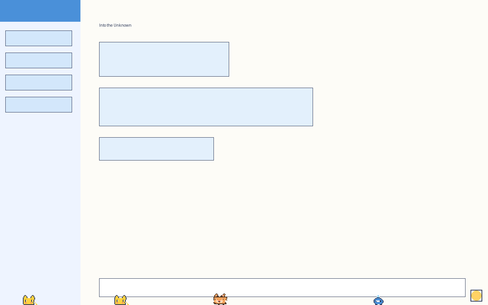
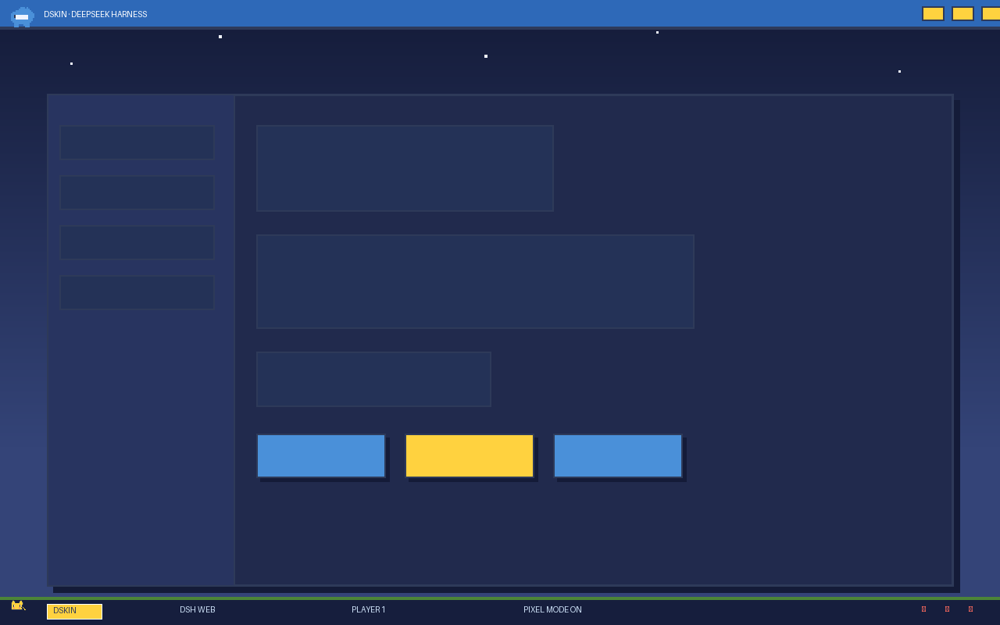
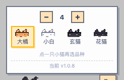
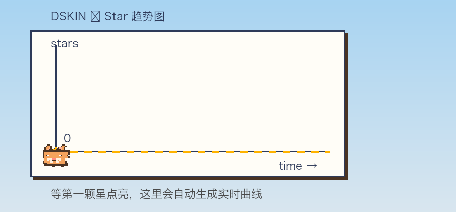

<p align="center">
  
</p>

<h1 align="center">🐭 DSKIN · Pixel Pet Party 🐳</h1>

<p align="center">
  <b>A cartoon pixel skin plugin made exclusively for the DeepSeek Harness (DSH) Web GUI</b><br>
  <i>DeepSeek Harness（DSH）专用卡通像素皮肤插件</i>
</p>

<p align="center">
  <a href="https://github.com/topics/dsh-plugin"></a>
  <a href="LICENSE"></a>
  <a href="https://github.com/dancingmemory/dskin"></a>
  
  
</p>

---

**📖 Intro / 简介**

> **DSKIN** is a lightweight cartoon pixel skin plugin for DeepSeek Harness
> (DSH): the UI stays untouched — tiny pixel pets live at the screen edge.
>
> *DSKIN 是 DeepSeek Harness（DSH）的轻量化卡通像素皮肤插件：
> 界面零改动，只在屏幕底边养几只小像素宠物。*

**Zero UI changes, zero obstruction.** DSKIN adds no frame, no background and
no layout changes — it just keeps a troop of small pixel pets at the bottom
edge of your screen.

Each page load spawns **1–4 random kittens** (🐱 大橘 orange tabby / 小白 white /
玄猫 black / 花猫 tuxedo) that stroll along the bottom edge. They approach,
chase, and play with each other. The **paw button 🐾** in the bottom-right
corner lets you toggle the palette to pick any kitten you like.

> **Pure presentation skin**: no service injection, no cordis events, no model
> traffic. Follows the official `dsh.client` client plugin contract —
> hot-pluggable and fully reversible on uninstall.

## ✨ Features

| | |
| --- | --- |
| 🐱 **1–4 random kittens** | each page load spawns a random crew that stroll along the bottom edge |
| 🤝 **Kitten interactions** | kittens approach, chase, and play with each other |
| 🐾 **Paw button** | bottom-right switcher to toggle the palette and pick any kitten |
| 👟 **Living pets** | stepping / blinking / edge turns / hover bounce / click hop / pixel shadow |
| 📏 **No obstruction** | pets stay at the screen edge; no frame, no background, native UI |
| 🐱 **Pixel favicon** | current kitten head + product title `DSKIN · DeepSeek Harness` |
| ✅ **Zero intrusion** | native fonts, buttons, inputs, scrollbars and layout |

## 🖼️ Previews

| Light | Dark |
| --- | --- |
|  |  |

### 🎮 Controls



> 点击小猫选中它（头顶出现 ★），再点品种按钮换色；★ 10 秒后自动消失。
> *Click a kitten to select it (★ appears), then pick a breed; the ★ auto-clears after 10s.*
*Pixel kitten selector panel*


*Paw switcher button (bottom-right)*

## 🤖 One-Click Install (hand to your AI)

Copy the line below and paste it to your AI assistant (e.g. opencode / Claude / a DSH agent):

> **Please install the https://github.com/dancingmemory/dskin plugin on my DSH and make it show up in the plugin tools.**

The AI should run:

```sh
# 1. install the plugin (into the web profile)
dsh plugin --profile web add github:dancingmemory/dskin

# 2. if pnpm ≥ 10 blocks build scripts, append this to
#    ~/.dsh/profiles/web/pnpm-workspace.yaml and re-run step 1
#    allowBuilds:
#      dskin: true

# 3. restart the web service so the plugin enters the loading graph
dsh web

# 4. verify: Settings → Plugins lists dskin (ui-skin-dskin), the 🐾 paw
#    button appears bottom-right, and kittens stroll at the screen edge
```

## 📦 Install

Requires the DeepSeek Harness `dsh` CLI (or `npx @deepseek-ai/dsh`).

### Option 1: from GitHub (recommended)

```sh
dsh plugin --profile web add github:dancingmemory/dskin
```

> pnpm ≥ 10 may refuse to run build scripts for git dependencies on first
> install. `dsh` prints the fix: add `allowBuilds: dskin: true` to the
> profile's `pnpm-workspace.yaml`, then re-run.

### Option 2: from source

```sh
git clone https://github.com/dancingmemory/dskin.git
cd dskin && pnpm install
dsh plugin --profile web add .
```

### Option 3: tarball

```sh
pnpm pack && dsh plugin --profile web add ./dskin-0.3.0.tgz
```

## 🚀 Usage

```sh
dsh web        # restart after installing — plugin rows load at boot only
```

Open `http://127.0.0.1:3080` — the kittens are already strolling at the
bottom edge. To revert: `dsh plugin --profile web remove dskin` and restart.

## 🔒 Privacy & Scope / 安全边界

DSKIN runs **only inside your own DSH Web app page** (default `http://127.0.0.1:3080`):

- **Not a browser extension**: it never runs on other websites and never touches
  browser settings, homepage, search engine or other pages
- **No data collection**: no analytics, no tracking, no third-party scripts;
  it only reads/writes the DSH page's own localStorage (kitten config)
- **The only network request**: a read-only GitHub check for new versions every
  6 hours; the upgrade page only opens after you click the button
- **Fully reversible**: `dsh plugin --profile web remove dskin` + restart and
  the page is restored completely

## ⭐ Star History



> GitHub recently restricted the public stargazers API, so the chart shows a
> placeholder for now; once the first ⭐ arrives it switches to a live curve.
> *GitHub 近期限制了 star 数据公开接口，趋势图暂时以占位形式展示；等收到第一颗 ⭐ 后会切换为实时曲线。*

Like DSKIN? Hit ⭐ and help the curve grow.
*喜欢 DSKIN？点个 ⭐ 支持一下。*

## 🛠️ Development

```sh
pnpm install   # installs deps + prepare builds lib/
pnpm build     # tsdown: lib/index.js (host) + lib/client.js (browser bundle)
pnpm test      # vitest: apply/dispose contract tests
```

```
├── package.json          # dsh.bundle patch + dsh.client manifest (official contract)
├── cordis.patch.yml      # inserts the ui-skin-dskin row into the web roster
├── skin.json             # skin metadata
├── tsdown.shared.ts      # self-contained port of the official clientBundle preset
├── web-platform.ts       # official platform module table (external judgement)
├── src/client/
│   ├── index.ts          # apply(ctx) + PixelPet state machine (idle/blink/walk/jump)
│   ├── mascots.ts        # 8-frame pet pixel SVGs (generated by scripts/gen-mascots.mjs)
│   └── dskin.module.css  # styles, all scoped under body[data-dsh-dskin]
├── tests/apply.spec.ts   # apply/dispose contract tests
├── assets/               # logo + banner promo art
└── scripts/              # pet frame / preview / promo generators
```

**Skin contract (official standard)**: pure presentation; styles scoped under
`body[data-dsh-dskin]` (dark `[data-ds-dark-theme]`); `apply(ctx)` retracts
everything it writes in the `ctx.effect` disposer; CSS Modules are injected and
removed by the loader; no static assets (pets are inline SVGs).

## 📄 License

MIT License. Original logo and pixel art; the whale pays homage to the
DeepSeek whale mascot.
