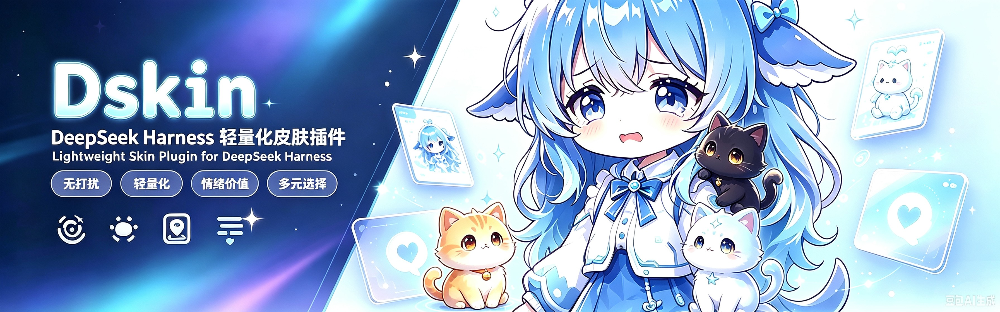
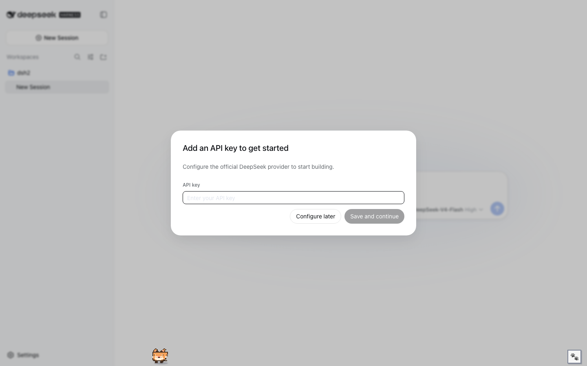
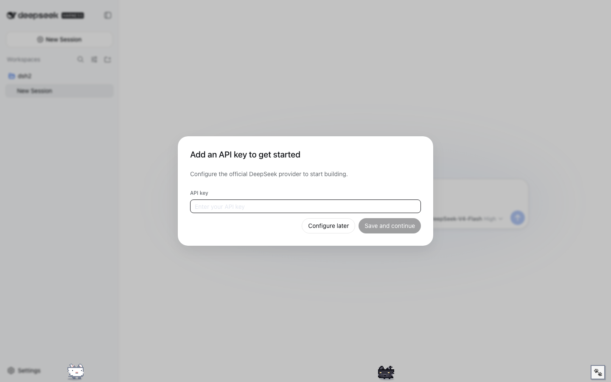
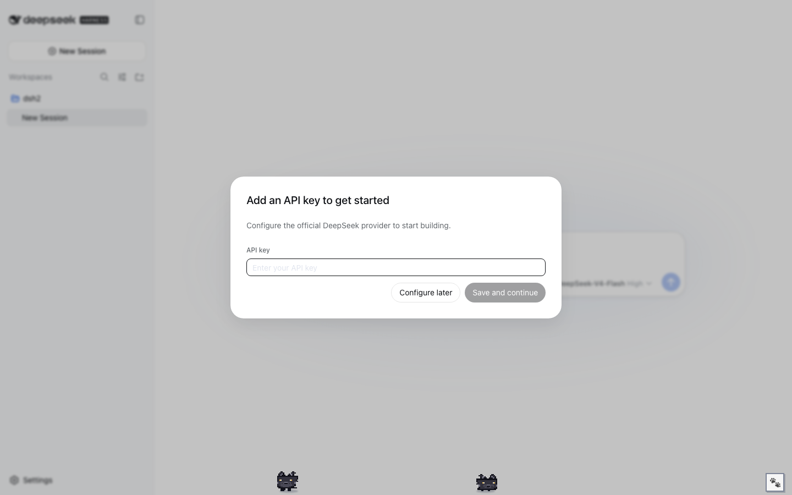
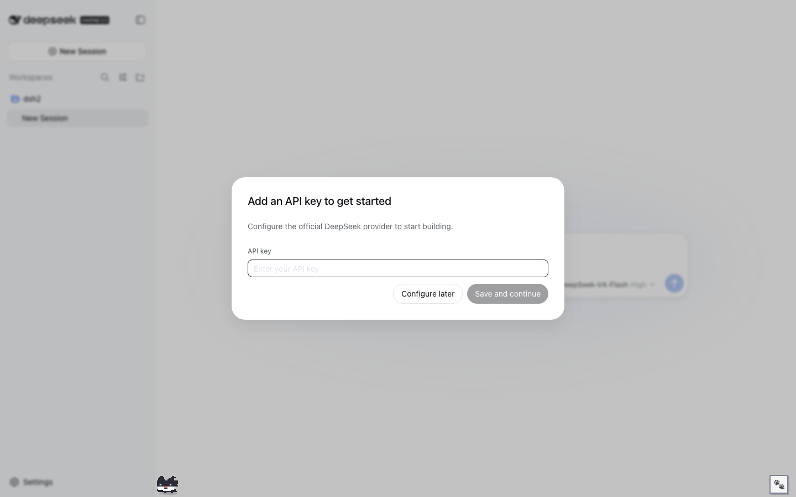

<p align="center">
  
</p>

<h1 align="center">🐱 DSKIN · 像素小猫派对</h1>

<p align="center">
  <b>DeepSeek Harness（DSH）专用卡通像素皮肤插件</b><br>
  <i>A cartoon pixel kitten plugin made exclusively for the DeepSeek Harness (DSH) Web GUI</i>
</p>

<p align="center">
  <a href="https://github.com/topics/dsh-plugin"></a>
  <a href="LICENSE"></a>
  <a href="https://github.com/dancingmemory/dskin"></a>
  
</p>

---

**界面零改动，只养猫。** DSKIN 不加外框、不改背景、不动布局——每次打开页面，
屏幕底边会**随机出现 1~4 只像素小猫**，它们散步、玩耍、可以被你抓住拖来拖去。

> **纯皮肤插件**：不注入服务、不发事件、不触碰模型请求。遵循官方
> `dsh.client` 客户端插件契约，可热插拔、可卸载，卸载后完整还原。

## ✨ 特性 / Features

| | |
| --- | --- |
| 🐱 **1~4 随机小猫** | 每次刷新随机出现 1~4 只（大橘 / 小白 / 玄猫 / 花猫），可手动加减 |
| 🤝 **猫咪互动** | 相遇会面对面玩耍、蹦跳，然后各自散开；点击一只，它跳起来 |
| 🎨 **每只独立换装** | 面板里点一只小猫（选中），再点品种，只改那一只 |
| 🖐️ **可拖拽 + 挂顶** | 抓住小猫到处拖；拖到屏幕顶边会**倒挂**住不落，再抓住拉下来即可 |
| 💕 **摸猫冒爱心** | 鼠标停在猫身上，它会开心蹦跶并冒出 ♥ |
| 🐾 **爪爪面板** | 右下角 🐾：`− N ＋` 加减小猫数量，品种按钮给选中的小猫换装，全部记住 |
| 📏 **不挡视线** | 活动区限定在屏幕底部，无外框无背景，界面完全原生 |

## 🖼️ 实拍 / Live Shots

DSKIN 在 DSH Web 中的实际效果（暗色主题）：

| 🐱 大橘 | 🐱 小白 |
| --- | --- |
|  |  |

| 🐱 玄猫 | 🐱 花猫 |
| --- | --- |
|  |  |

## 🎮 玩法 / Play

- **看它们玩**：小猫在屏幕底部散步、眨眼、到边转身；两只靠近时会停下来面对面蹦跳，然后散开。
- **拖拽**：按住小猫拖到任意位置——它会在半空挣扎（摇摆 + "!" 气泡）；**拖到屏幕顶边会倒挂住**，松手也不会掉下来，抓住拉下来才回地面。
- **摸**：鼠标悬停在猫身上，它开心蹦跶并冒爱心 ♥。
- **点击**：猫跳一下。
- **切换品种**：右下角 🐾 面板——先点一只小猫选中，再点品种按钮只给那只换装；`− ＋` 可以加减小猫数量。

## 📦 安装 / Install

要求：DeepSeek Harness `dsh` CLI（或 `npx @deepseek-ai/dsh`）。

```sh
# GitHub 安装（推荐）
dsh plugin --profile web add github:dancingmemory/dskin

# 源码安装
git clone https://github.com/dancingmemory/dskin.git
cd dskin && pnpm install
dsh plugin --profile web add .
```

> pnpm ≥ 10 首次安装 git 依赖可能拒绝执行构建脚本，dsh 会提示你把
> `allowBuilds: dskin: true` 写进 profile 的 `pnpm-workspace.yaml`，重跑即可。

## 🚀 使用 / Usage

```sh
dsh web        # 安装后重启，让新插件行进入加载图谱
```

打开 `http://127.0.0.1:3080`，小猫已经在你屏幕底边等你了。
还原：`dsh plugin --profile web remove dskin` 再重启。

## 🔍 发现 / Discoverability

本仓库已打上官方 **`dsh-plugin`** 主题标签，可在
[github.com/topics/dsh-plugin](https://github.com/topics/dsh-plugin) 下被索引到，
另带 `dsh` / `deepseek-harness` / `pixel-art` 等标签。

## 🛠️ 开发 / Development

```sh
pnpm install   # 安装依赖 + prepare 自动构建
pnpm build     # tsdown: lib/index.js (host) + lib/client.js (browser bundle)
pnpm test      # vitest: apply/dispose/拖拽 契约测试
```

```
├── package.json          # dsh.bundle 补丁 + dsh.client 清单（官方插件契约）
├── cordis.patch.yml      # 向 web 图谱插入 ui-skin-dskin 行
├── skin.json             # 皮肤元数据
├── tsdown.shared.ts      # 官方 clientBundle 构建预设的独立移植（自包含）
├── web-platform.ts       # 官方平台模块表（bundle external 判定）
├── src/client/
│   ├── index.ts          # apply(ctx) + 小猫状态机（idle/walk/互动/拖拽/回巢）
│   ├── mascots.ts        # 4 只小猫 × 4 帧像素 SVG（scripts/gen-mascots.mjs 生成）
│   └── dskin.module.css  # 样式，全部作用域于 body[data-dsh-dskin]
├── tests/apply.spec.ts   # 契约测试
├── assets/               # banner / logo / 实拍截图
└── scripts/              # 猫帧 / 预览图 / 宣传图生成器
```

**皮肤契约（官方标准）**：纯呈现层；样式全部挂在 `body[data-dsh-dskin]`；
`apply(ctx)` 写什么就在 `ctx.effect` disposer 里收回什么；CSS Modules 由加载器
注入/移除；不携带静态资源（小猫为内联 SVG）。

## 📄 许可 / License

MIT License。Logo 与小猫像素画为原创；参考了 DeepSeek 鲸鱼吉祥物形象。
