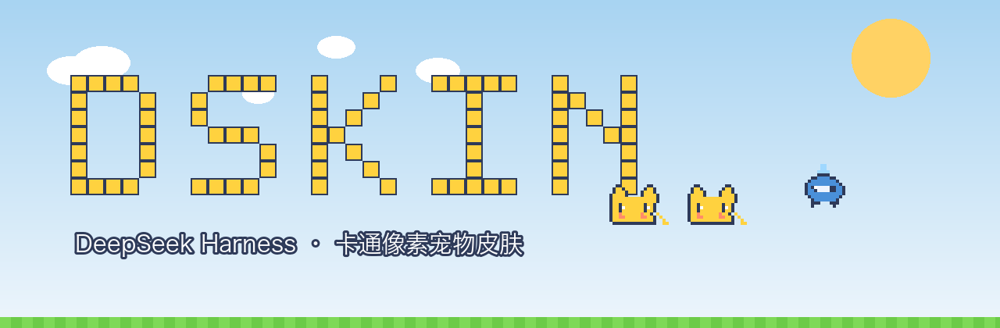

<p align="center">
  
</p>

<h1 align="center">🐭 DSKIN · 像素宠物派对 🐳</h1>

<p align="center">
  <b>DeepSeek Harness（DSH）专用卡通像素皮肤插件</b><br>
  <i>A cartoon pixel skin plugin made exclusively for the DeepSeek Harness (DSH) Web GUI</i>
</p>

<p align="center">
  <a href="https://github.com/topics/dsh-plugin"></a>
  <a href="LICENSE"></a>
  <a href="https://github.com/dancingmemory/dskin"></a>
  
</p>

---

**原始界面，一概不动。** DSKIN 不换字体、不重排布局、不动按钮——它只在你的
DSH 桌面上做一件事：**放一群会动的像素宠物。**

两只黄色卡通电击鼠在底部的像素草地上散步，踏步、眨眼、到边缘自动转身；
一条像素鲸鱼在天空里慢悠悠地游。鼠标悬停宠物会蹦跶，**点一下它还会跳起来。**

> **纯皮肤插件**：不注入服务、不发事件、不触碰模型请求。遵循官方
> `dsh.client` 客户端插件契约，可热插拔、可卸载，卸载后完整还原。

## ✨ 特性 / Features

| | |
| --- | --- |
| 🐭 **多宠物** | 2 只像素鼠散步 + 1 条像素鲸游弋，各自独立行动、随机速度 |
| 👟 **会动的宠物** | 踏步动画 / 眨眼 / 到边转身 / 悬停蹦跶 / 点击起跳 / 像素影子 |
| ☀️ **卡通桌面** | 浅蓝天空 + 云朵 + 太阳，底部像素草地条（暗色：星空 + 夜色草地） |
| 🖼️ **游戏机窗框** | 应用窗口内嵌 12px，3px 像素描边 + 硬阴影，完整露出天空 |
| 🐭 **像素 favicon** | 宠物头像 + 产品标题 `DSKIN · DeepSeek Harness` |
| 🌙 **双主题** | 亮/暗跟随 DSH 外观设置，`prefers-reduced-motion` 友好 |
| ✅ **零侵入** | 字体、按钮、输入框、滚动条、布局全部原生 |

## 🖼️ 预览 / Previews

| 亮色主题 | 暗色主题 |
| --- | --- |
|  |  |

## 📦 安装 / Install

要求：DeepSeek Harness `dsh` CLI（或 `npx @deepseek-ai/dsh`）。

### 方式一：GitHub 安装（推荐）

```sh
dsh plugin --profile web add github:dancingmemory/dskin
```

> pnpm ≥ 10 首次安装 git 依赖可能拒绝执行构建脚本，dsh 会提示你把
> `allowBuilds: dskin: true` 写进 profile 的 `pnpm-workspace.yaml`，重跑即可。

### 方式二：源码安装

```sh
git clone https://github.com/dancingmemory/dskin.git
cd dskin && pnpm install
dsh plugin --profile web add .
```

### 方式三：tarball

```sh
pnpm pack && dsh plugin --profile web add ./dskin-0.3.0.tgz
```

## 🚀 使用 / Usage

```sh
dsh web        # 安装后重启，让新插件行进入加载图谱
```

打开 `http://127.0.0.1:3080`——像素宠物已经在草地上散步了。
想还原：`dsh plugin --profile web remove dskin` 再重启。

## 🔍 发现 / Discoverability

本仓库已打上官方 **`dsh-plugin`** 主题标签，可在
[github.com/topics/dsh-plugin](https://github.com/topics/dsh-plugin) 下被索引到，
另带 `dsh` / `deepseek-harness` / `pixel-art` 等标签。

## 🛠️ 开发 / Development

```sh
pnpm install   # 安装依赖 + prepare 自动构建
pnpm build     # tsdown: lib/index.js (host) + lib/client.js (browser bundle)
pnpm test      # vitest: apply/dispose 契约测试
```

```
├── package.json          # dsh.bundle 补丁 + dsh.client 清单（官方插件契约）
├── cordis.patch.yml      # 向 web 图谱插入 ui-skin-dskin 行
├── skin.json             # 皮肤元数据
├── tsdown.shared.ts      # 官方 clientBundle 构建预设的独立移植（自包含）
├── web-platform.ts       # 官方平台模块表（bundle external 判定）
├── src/client/
│   ├── index.ts          # apply(ctx) + PixelPet 状态机（idle/blink/walk/jump）
│   ├── mascots.ts        # 宠物 8 帧像素 SVG（scripts/gen-mascots.mjs 生成）
│   └── dskin.module.css  # 样式，全部作用域于 body[data-dsh-dskin]
├── tests/apply.spec.ts   # apply/dispose 契约测试
├── assets/               # logo + banner 宣传图
└── scripts/              # 宠物帧 / 预览图 / 宣传图生成器
```

**皮肤契约（官方标准）**：纯呈现层；样式全部挂在 `body[data-dsh-dskin]`
（暗色 `[data-ds-dark-theme]`）；`apply(ctx)` 写什么就在 `ctx.effect` disposer
里收回什么；CSS Modules 由加载器注入/移除；不携带静态资源（宠物为内联 SVG）。

## 📄 许可 / License

MIT License。Logo 与宠物像素画为原创；参考了 DeepSeek 鲸鱼吉祥物形象。
